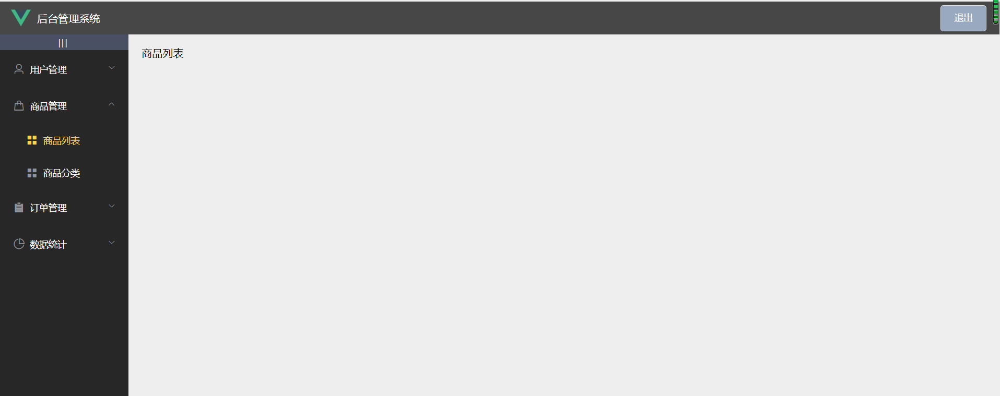
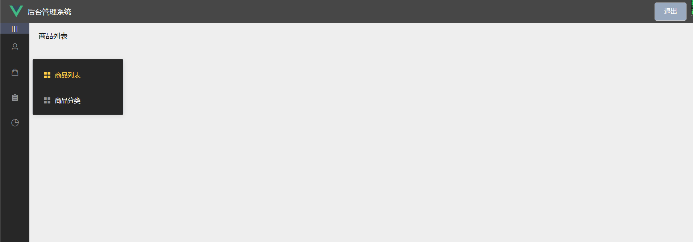

# vue3_element

## 登录

```sh
邮箱：admin@admin.com
密码：123456
cookie 有效时间10分钟
```

## 网页预览

https://yngwejun.github.io/vue3_element

## element.ts

```ts
import {
  ElButton,
  ElForm,
  ElFormItem,
  ElInput,
  ElLink,
  ElContainer,
  ElHeader,
  ElAside,
  ElMain,
  ElMenu,
  ElMenuItem,
  ElMenuItemGroup,
  ElSubmenu,
  ElRow,
  ElCol,
  ElAlert
} from 'element-plus'
import lang from 'element-plus/lib/locale/lang/zh-cn'
import locale from 'element-plus/lib/locale'
import { App } from 'vue'

const components = [
  ElButton,
  ElForm,
  ElFormItem,
  ElInput,
  ElLink,
  ElContainer,
  ElHeader,
  ElAside,
  ElMain,
  ElMenu,
  ElMenuItem,
  ElMenuItemGroup,
  ElSubmenu,
  ElRow,
  ElCol,
  ElAlert
]

export default (app:App<Element>):void => {
  locale.use(lang)
  components.forEach(component => {
    app.use(component)
  })
  // app.use(ElButton).use(ElFormItem).use(ElForm).use(ElInput).use(ElLink).use(ElMain).use(ElMenu).use(ElHeader).use(ElContainer).use(ElAside)
}
```

## main.ts

```ts
import { createApp } from 'vue'
import App from './App.vue'
import router from './router'
import store from './store'
import installElementPlus from './plugins/element'
import VueCookies from 'vue-cookies'

const app = createApp(App)
// app.config.globalProperties.$cookies = VueCookies
app.provide('$cookies', VueCookies)
installElementPlus(app)
app.use(store).use(router).mount('#app')
```

## cookie

##### cookie模块
```ts
export function setCookies (cname:string, cvalue:string, secound:number):void {
  const d = new Date()
  d.setTime(d.getTime() + (secound * 1000))
  const expires = 'expires=' + d.toUTCString()
  document.cookie = cname + '=' + cvalue + ';' + expires
}
export function getCookies (cname:string):string|undefined {
  const name = cname + '='
  const ca = document.cookie.split(';')
  for (let i = 0; i < ca.length; i++) {
    const c = ca[i].trim()
    if (c.indexOf(name) === 0) {
      return c.substring(name.length, c.length)
    }
    return ''
  }
}
```

##### vue-cookies的使用
###### main.ts中使用
引入
```sh
import VueCookies from 'vue-cookies'
```
使用
```ts
app.provide('$cookies', VueCookies)
```

###### vue组件中使用

引入
```js
import { VueCookies } from 'vue-cookies'
import { inject } from 'vue'
```
使用
```ts
setup () {
    const cookies = inject<VueCookies>('$cookies')
    const token = cookies?.get('token')
    // console.log('token', token)
    const router = useRouter()
    const goto = () => {
      router.push('/login')
    }
    if (token === null) {
      goto()
    }
    return {
      goto
    }
  }
  ```

  ## Mock.js

  ##### 安装
  ```sh
  npm i mockjs -S
  ```

  ##### 使用

  ###### mock模块
  ```js
import { setCookies } from '@/cookies'
import axios from 'axios'

export function login (
  email:string,
  password:string,
  goto:() => void,
  changeMode: (number) => void,
  getTip: (string) => void
):void {
  console.log(email, password)
  axios({
    url: '/users',
    method: 'post',
    data: {
      user: {
        email,
        password
      }
    },
    responseType: 'json'
  }).then(res => {
    const { token, code, user } = res.data
    if (code === 200) {
      const { username, email } = user
      setCookies('token', token, 60 * 60)
      setCookies('user', username, 60 * 60)
      setCookies('email', email, 60 * 60)
      changeMode(1)
      const timer = setTimeout(() => {
        goto()
        clearTimeout(timer)
      }, 1000)
    } else if (res.data.code === 401) {
      changeMode(2)
      // alert(res.data.message)
      // console.log('message', typeof res.data.message)
      getTip(res.data.message)
      // goto()
    }
    console.log(res.data)
  }).catch(err => {
    console.log(err)
  })
}
```

###### 在需要的组件中导入

```js
import '../mock/login.js'
```

## axios

##### login
```ts
import { setCookies } from '@/cookies'
import axios from 'axios'

export function login (
  email:string,
  password:string,
  goto:() => void,
  changeMode: (number) => void,
  getTip: (string) => void
):void {
  console.log(email, password)
  axios({
    url: '/users',
    method: 'post',
    data: {
      user: {
        email,
        password
      }
    },
    responseType: 'json'
  }).then(res => {
    const { token, code, user } = res.data
    if (code === 200) {
      const { username, email } = user
      setCookies('token', token, 60 * 10)
      setCookies('user', username, 60 * 10)
      setCookies('email', email, 60 * 10)
      changeMode(1)
      const timer = setTimeout(() => {
        goto()
        clearTimeout(timer)
      }, 1000)
    } else if (res.data.code === 401) {
      changeMode(2)
      // alert(res.data.message)
      // console.log('message', typeof res.data.message)
      getTip(res.data.message)
      // goto()
    }
    console.log(res.data)
  }, err => {
    console.log(err)
  })
}
```

## gh-pages

##### 安装包

```sh
npm install gh-pages --save-dev
```

##### pakeage.json配置

```json
"homepage": "https://yngwejun.github.io/vue3_element"
```
script字段

```json
"deploy": "gh-pages -d dist"
```

项目根目录下新建配置文件`vue.config.js`
描述：这样做是为了在gh-pages分支展示项目网页时在 `https://yngwejun.github.io`之后加上
`/vue3_element`,这样请求到的资源，路劲才正确。
```js
module.exports = {
  publicPath: process.env.NODE_ENV === "production" ? "/vue3_element" : "/"
}
```

部署

```sh
npm run deploy
```

## 主页左侧菜单的折叠效果和路由

##### 图片展示





`<el-menu>`的`collapse`属性默认为false表示没有折叠，改为true表示折叠，`collapse-transition`为false表示关闭动画效果，`router`属性表示开启路由。当加入这个属性之后，则在`<el-menu-item>`的`index`属性会作为路由名称，点击时自动跳转该路由。

###### 此时的路由文件如此

```ts
import { createRouter, createWebHashHistory, RouteRecordRaw } from 'vue-router'

const routes: Array<RouteRecordRaw> = [
  {
    path: '/',
    name: 'Home',
    component: () => import('../views/Home.vue'),
    redirect: '/wellcome',
    children: [
      {
        path: '/wellcome',
        component: () => import('../components/WellCome.vue')
      },
      {
        path: '/users',
        component: () => import('../components/user/Users.vue')
      },
      {
        path: '/goods',
        component: () => import('../components/goods/Goods.vue')
      },
      {
        path: '/goodscate',
        component: () => import('../components/goods/GoodsCate.vue')
      },
      {
        path: '/orders',
        component: () => import('../components/order/Orders.vue')
      },
      {
        path: '/statdata',
        component: () => import('../components/statdata/StatData.vue')
      }
    ]
  },
  {
    path: '/:catchAll(.*)',
    name: '404',
    component: () => import('../views/404.vue')
  },
  {
    path: '/login',
    name: 'LoginRegister',
    component: () => import('../views/Login.vue')
  }
]

const router = createRouter({
  history: createWebHashHistory(),
  routes
})

export default router
```

###### 此时的左侧栏组件代码如此

```html
<template>
  <el-aside :width="asideWidth" style="background-color: #272727;height: 100%;">
    <div class="toggle-btn" @click="toggleCollapse">|||</div>
    <el-menu
      :uniqueOpened="true"
      class="el-menu-vertical-demo"
      text-color="#fff"
      background-color="#272727"
      active-text-color="#ffd04b"
      @open="handleOpen"
      @close="handleClose"
      :collapse="collapseMode"
      :collapse-transition="false"
      router
    >
      <!-- 一级菜单 -->
      <el-submenu :index="item.id" v-for="item in menuList" :key="item.id">
        <template #title>
          <i :class="item.icon"></i>
          <span>{{ item.name }}</span>
        </template>
        <!-- 二级菜单 -->
        <el-menu-item :index="child.path" v-for="child in item.children" :key="child.id">
          <template #title>
            <i class="el-icon-menu"></i>
            <span>{{ child.name }}</span>
          </template>
        </el-menu-item>
      </el-submenu>
    </el-menu>
  </el-aside>
</template>

<script lang="ts">
import { defineComponent, ref } from '@vue/runtime-core'

export default defineComponent({
  setup () {
    const handleOpen = (key, keyPath) => {
      console.log(key, keyPath)
    }
    const handleClose = (key, keyPath) => {
      console.log(key, keyPath)
    }
    // 默认情况下el-menu是展开的
    const collapseMode = ref<boolean>(false)
    // 侧边栏的宽度
    const asideWidth = ref<string>('200px')
    // 菜单的折叠与展开效果
    const toggleCollapse = () => {
      // 改变折叠模式的boolean值
      collapseMode.value = !collapseMode.value
      // 调整el-aside的宽度，菜单折叠时变为el-menu的宽度
      collapseMode.value === false ? asideWidth.value = '200px' : asideWidth.value = '64px'
    }
    // 左侧菜单数据
    const menuList = [
      { id: '1', name: '用户管理', icon: 'el-icon-user', children: [{ id: '1-1', name: '用户列表', path: '/users' }] },
      { id: '2', name: '商品管理', icon: 'el-icon-goods', children: [{ id: '2-1', name: '商品列表', path: '/goods' }, { id: '2-2', name: '商品分类', path: '/goodscate' }] },
      { id: '3', name: '订单管理', icon: 'el-icon-s-order', children: [{ id: '3-1', name: '订单列表', path: '/orders' }] },
      { id: '4', name: '数据统计', icon: 'el-icon-pie-chart', children: [{ id: '4-1', name: '统计信息', path: '/statdata' }] }
    ]
    return {
      handleOpen,
      handleClose,
      menuList,
      toggleCollapse,
      collapseMode,
      asideWidth
    }
  }
})
</script>
```

## 用户管理分页

mock数据

```js
// 引入Mock
import Mock from 'mockjs'

// mock一个数组
const _users = Mock.mock({
  'users|400': [
    {
      id: '@id()',
      username: '@cname',
      email: '@email',
      address: '@county(true)',
      'age|18-40': 18,
      'sex|1': ['男', '女'],
      avatar: Mock.Random.image('50x50'),
      'msg_state|1': [false, true]
    }
  ]
}).users
// console.log('_users', _users)
// get请求获取用户列表数据
Mock.mock(/\/users/, 'get', req => {
  // console.log('req', req.url)
  const { url } = req
  const pagenum = /(?<=pagenum=)\d+/.exec(url)[0]
  const pagesize = /(?<=pagesize=)\d+/.exec(url)[0]
  const arr = url.split('&')
  let data = []
  const totalpages = _users.length
  // console.log('pagenum', pagenum)
  // console.log('pagenum', pagesize)
  // console.log('query', arr[0])
  if (arr[0] === '/users?query=') {
    const start = (pagenum - 1) * pagesize
    const end = pagenum * pagesize
    data = _users.slice(start, end)
    // console.log('data', data)
  }
  return {
    code: 200,
    totalpages,
    pagenum,
    users: data
  }
})
```

axios请求

```js
export async function getUsers (queryInfo:queryInfoData):Promise<any> {
  const result = await axios.get('/users', { params: queryInfo }).then(res => {
    // console.log(res.data)
    return res.data
  }).catch(err => {
    console.log(err)
    return {
      code: 500,
      message: err
    }
  })
  // console.log('result', result)
  return result
}
```
```
 <!-- 分页 -->
<el-pagination
  @size-change="handleSizeChange"
  @current-change="handleCurrentChange"
  :current-page="queryInfo.pagenum"
  :page-sizes="[1, 2, 5, 8, 10]"
  :page-size="queryInfo.pagesize"
  layout="total, sizes, prev, pager, next, jumper"
  :total="total">
</el-pagination>
```

```ts
import { defineComponent, onMounted, ref } from 'vue'
import '@/mock/users'
import { getUsers } from '@/axios'

export default defineComponent({
  setup () {
    const userList = ref([])
    const total = ref(0)
    const queryInfo = ref({
      query: '',
      pagenum: 1,
      pagesize: 5
    })
    // 获取用户数据
    const getUserList = () => {
      const result = getUsers(queryInfo.value)
      result.then(data => {
        const { users, totalpages, code } = data
        if (code === 200) {
          userList.value = users
          total.value = totalpages
        }
        // console.log('data', data)
      })
    }
    onMounted(() => {
      getUserList()
    })
    // 改变每页记录数
    const handleSizeChange = (newSize) => {
      queryInfo.value.pagesize = newSize
      getUserList()
    }
    // 改变页数
    const handleCurrentChange = (newPage) => {
      queryInfo.value.pagenum = newPage
      getUserList()
    }
    // 监听状态改变
    const userStateChange = (user) => {
      console.log(user)
    }
    // 删除用户
    const handleEditUser = (user) => {
      console.log(user)
    }
    return {
      userList,
      handleSizeChange,
      handleCurrentChange,
      queryInfo,
      total,
      userStateChange,
      handleEditUser
    }
  }
})
```